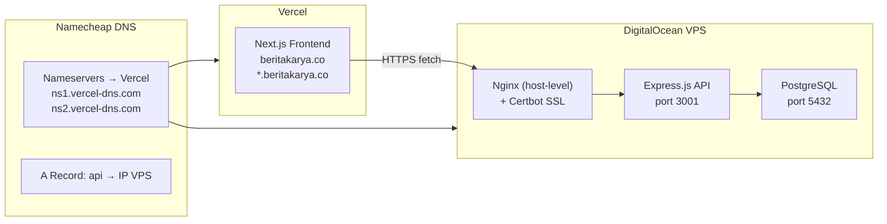
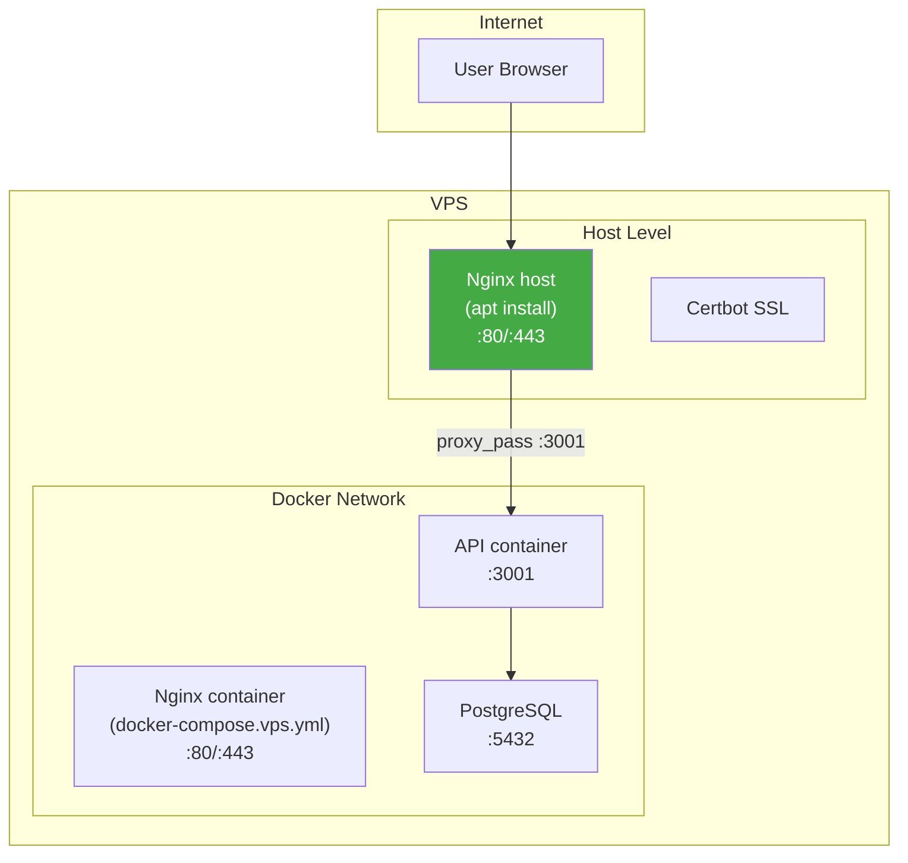

# 🔍 Audit Mendalam: Infrastruktur, Domain & Nginx

---

## 1. AUDIT FOLDER `infra/`

### Struktur

```
infra/
├── docker/
│   ├── api.Dockerfile              ← Multi-stage build API (3 stage)
│   ├── web.Dockerfile              ← Multi-stage build Next.js (3 stage)
│   ├── docker-compose.yml          ← Dev: PostgreSQL saja
│   ├── docker-compose.backend.yml  ← VPS: API + PostgreSQL (YANG DIPAKAI)
│   └── docker-compose.prod.yml     ← Full stack (DEPRECATED)
├── nginx/
│   ├── nginx.conf                  ← Dev: proxy ke web:3000 + api:3001
│   ├── nginx.staging.conf          ← Staging: HTTP only
│   └── nginx.prod.conf             ← Production: HTTPS + SSL (YANG DIPAKAI)
└── scripts/
    ├── setup-server.sh             ← Provisioning VPS (UFW, Docker, swap)
    ├── setup-ssl.sh                ← Wildcard SSL via certbot DNS-01
    └── backup-database.sh          ← pg_dump + gzip + rotate 7 hari
```

### Temuan Kritis

> [!CAUTION]
> ### BUG #1: Ada 4 Docker Compose files — membingungkan, saling konflik

| File | Digunakan? | Masalah |
|------|-----------|---------|
| `docker-compose.yml` | Dev local | ✅ OK, PostgreSQL saja |
| `docker-compose.backend.yml` | **Ya, di VPS** | ⚠️ Port 3001 di-PUBLISH ke host (`ports: "3001:3001"`) |
| `docker-compose.prod.yml` | Tidak aktif | 🔴 DEPRECATED — Digantikan oleh backend.yml |

**Masalah inti**: `docker-compose.backend.yml` meng-expose port `3001:3001` ke host. Ini berarti API bisa diakses langsung via `IP:3001` DAN via Nginx di `localhost:3001`. Dua jalur masuk = sumber konflik.

---

> [!CAUTION]
> ### BUG #2: docker-compose.prod.yml depends_on `web` — tapi web di Vercel!

```yaml
# docker-compose.prod.yml line 15-19
nginx:
  depends_on:
    web:                    # ← WEB TIDAK ADA DI VPS!
      condition: service_healthy
    api:
      condition: service_healthy
```

File ini mereferensikan container `web:3000` yang **tidak ada** di VPS karena frontend di-deploy ke Vercel. Nginx akan **gagal start** jika file ini dipakai.

---

> [!CAUTION]
> ### BUG #3: Dua Nginx bertabrakan — (DISELESAIKAN)
> 
> Sebelumnya `docker-compose.vps.yml` menjalankan Nginx di dalam Docker yang bertabrakan dengan Nginx host.
> **Solusi**: File `docker-compose.vps.yml` telah dihapus. Sekarang sistem hanya menggunakan Nginx di level host.

---

> [!WARNING]
> ### BUG #4: nginx.conf (dev) mereferensikan `$subdomain` yang tidak pernah didefinisikan

```nginx
# nginx.conf line 34
proxy_set_header X-Site-ID $subdomain;  # ← variabel tidak ada!
```

Nginx akan mengirim header `X-Site-ID` dengan nilai kosong.

---

> [!WARNING]
> ### BUG #5: nginx.staging.conf domain typo

```nginx
# nginx.staging.conf line 28
if ($host ~* "^([^.]+)\.staging\.beritakarya\.com$") {
#                                           ^^^^ seharusnya .co bukan .com!
```

---

## 2. AUDIT DOMAIN & DEPLOYMENT (Namecheap + Vercel)

### Arsitektur Saat Ini



### Domain Configuration

| Domain | Pointing To | Purpose |
|--------|------------|---------|
| `beritakarya.co` | Vercel (via NS) | Frontend utama |
| `*.beritakarya.co` | Vercel (wildcard) | Multi-tenant portal |
| `api.beritakarya.co` | VPS IP (A Record di Vercel DNS) | Backend API |

### Temuan

> [!CAUTION]
> ### BUG #6: `middleware.ts` TIDAK ADA — multi-tenant routing tidak aktif!

File `proxy.ts` ada di `apps/web/proxy.ts` tapi **TIDAK** ada file `middleware.ts` yang mengimportnya. Artinya:

- **Wildcard domain tidak berfungsi** — `bandung.beritakarya.co` tidak akan di-rewrite ke `/bandung/...`
- **Cookie `siteId` tidak pernah di-set** oleh middleware
- **Semua subdomain menampilkan halaman yang sama** tanpa tenant isolation

Dokumentasi `VERCEL_DEPLOYMENT.md` (line 54-58) bahkan menyebutkan ini perlu dibuat:
> *"Jika belum ada file middleware.ts, Anda bisa membuatnya"*

Tapi **tidak pernah dibuat**.

---

> [!WARNING]
> ### BUG #7: NEXT_PUBLIC_API_URL inkonsisten antara `.env` dan docs

| Lokasi | Nilai | Benar? |
|--------|-------|--------|
| `apps/web/.env` | `https://api.beritakarya.co` | ⚠️ Missing `/api/v1` |
| `apps/web/.env.example` | `http://localhost:3001` | ✅ (dev) |
| `VERCEL_DEPLOYMENT.md` | `https://api.beritakarya.co/api/v1` | ❌ Salah! |
| `lib/api.ts` | `${API_URL}/api/v1` | ✅ Menambah `/api/v1` |

Kode `api.ts` sudah benar — menambahkan `/api/v1` ke base URL. Jadi `.env` yang tanpa `/api/v1` **sudah benar**. Tapi dokumentasi menyesatkan.

---

> [!WARNING]
> ### BUG #8: SSL setup script menggunakan manual DNS challenge

`setup-ssl.sh` menggunakan `--manual --preferred-challenges=dns`. Ini berarti:
- **Renewal otomatis TIDAK BISA** (certbot memerlukan interaksi manual)
- Sertifikat expired setiap 90 hari tanpa peringatan
- Harus pakai **Certbot DNS plugin** (mis. `certbot-dns-cloudflare`) untuk auto-renewal

Tapi karena NS sudah di Vercel, **Certbot DNS plugin tidak bisa akses Vercel DNS API** secara native.

---

## 3. AUDIT PORT CRASH (3000 vs 3001)

### Sumber Masalah Utama



### Root Causes Teridentifikasi

> ### CRASH ROOT CAUSE #1: Dua Nginx berebut port — (DISELESAIKAN)
> 
> Sebelumnya terdapat konflik antara Nginx host dan Nginx Docker.
> **Solusi**: `docker-compose.vps.yml` telah dihapus.

---

> [!CAUTION]
> ### CRASH ROOT CAUSE #2: Port 3001 exposed ke host DAN ke Docker network

`docker-compose.backend.yml` (YANG DIPAKAI):
```yaml
api:
  ports:
    - "3001:3001"   # ← PUBLISH ke host, bisa diakses langsung
```

Jika menggunakan `backend.yml` (yang dipakai), API bisa diakses:
1. Via Nginx host → `proxy_pass http://localhost:3001` ✅
2. Via direct `http://IP:3001` ❌ **bypass semua security Nginx**

---

> [!WARNING]
> ### CRASH ROOT CAUSE #3: Nginx proxy_pass inconsistency

| Config File | proxy_pass Target | Konteks |
|------------|-------------------|---------|
| `nginx.prod.conf` | `http://api:3001` | Docker internal DNS (hanya jika Nginx di Docker) |
| `ALL_IN_ONE_VPS.md` | `http://localhost:3001` | Host-level Nginx ke Docker published port |
| `nginx.conf` (dev) | `http://backend` (upstream) | Docker Compose network |

**Masalah**: `nginx.prod.conf` menggunakan `http://api:3001` (Docker DNS name), tapi jika Nginx berjalan di **host level** (bukan Docker), hostname `api` **tidak bisa di-resolve** → `502 Bad Gateway`.

---

## 4. SOLUSI & REKOMENDASI

### ✅ Pilih SATU arsitektur — jangan campur

**Rekomendasi: Host Nginx + Docker Backend** (sesuai `ALL_IN_ONE_VPS.md`)

```
Internet → Nginx (host) → Docker API (:3001) → Docker PostgreSQL (:5432)
              ↑
         Certbot SSL
```

### Action Items (Urut Prioritas)

| # | Action | File | Urgency |
|---|--------|------|---------|
| 1 | **Buat `middleware.ts`** | `apps/web/middleware.ts` | 🔴 KRITIS |
| 2 | **Hapus Docker Nginx files** yang tidak dipakai | `docker-compose.prod.yml` (Selesai untuk vps.yml) | 🔴 KRITIS |
| 3 | **Ubah `ports` ke `expose`** di backend.yml | `docker-compose.backend.yml` | 🔴 KRITIS |
| 4 | **Buat Nginx host config** yang benar | `/etc/nginx/sites-available/api.beritakarya.co` | 🔴 KRITIS |
| 5 | **Fix SSL renewal** — gunakan Certbot standalone atau HTTP challenge | `setup-ssl.sh` | 🟡 HIGH |
| 6 | **Hapus `$subdomain`** dari nginx.conf dev | `infra/nginx/nginx.conf` | 🟡 MEDIUM |
| 7 | **Fix typo `.com`** di staging config | `infra/nginx/nginx.staging.conf` | 🟡 MEDIUM |
| 8 | **Update docs** — seragamkan NEXT_PUBLIC_API_URL | `VERCEL_DEPLOYMENT.md` | 🟢 LOW |

### Rekomendasi Arsitektur Final

```
┌──────────────────────────────────────────────────────┐
│                   NAMECHEAP                          │
│  NS → ns1.vercel-dns.com / ns2.vercel-dns.com       │
│  (Vercel manages all DNS)                            │
│                                                      │
│  beritakarya.co      → Vercel                        │
│  *.beritakarya.co    → Vercel (wildcard)             │
│  api.beritakarya.co  → A Record → VPS IP             │
└──────────────────────────────────────────────────────┘

┌──────────── VERCEL ────────────┐    ┌──────────── VPS ─────────────┐
│                                │    │                              │
│  Next.js 14                    │    │  Nginx (host-level)          │
│  + middleware.ts (proxy)       │    │  ├─ SSL via Certbot          │
│  + wildcard multi-tenant       │    │  └─ proxy_pass :3001         │
│                                │    │                              │
│  ENV:                          │    │  Docker Compose:             │
│  NEXT_PUBLIC_API_URL=          │    │  ├─ api (expose 3001)        │
│    https://api.beritakarya.co  │    │  └─ postgres (expose 5432)   │
│                                │    │                              │
└────────────────────────────────┘    └──────────────────────────────┘
```
