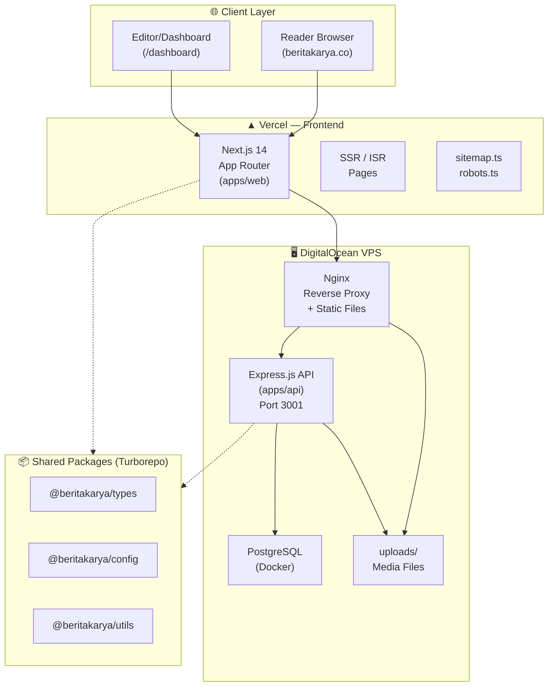
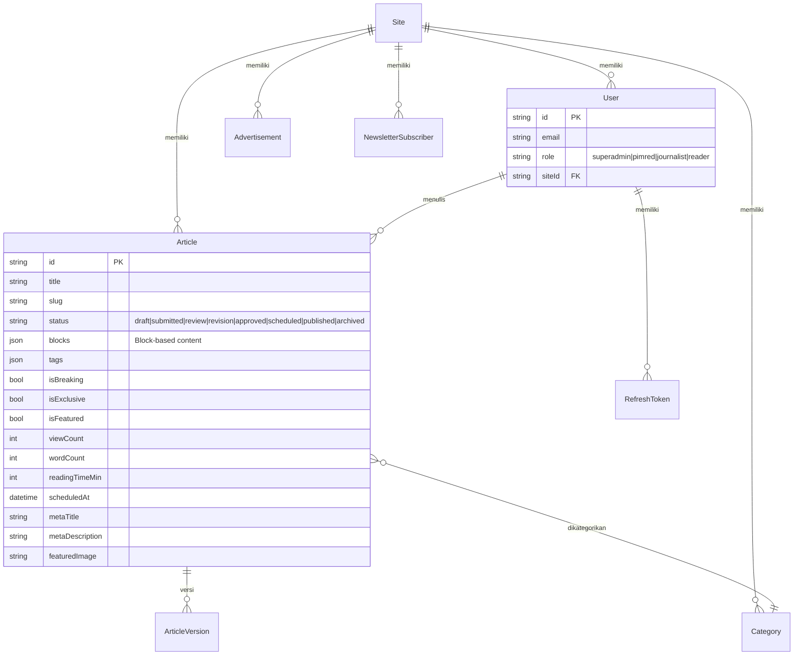

# 📰 BeritaKarya — Analisis Arsitektur Global News Platform

> **Senior Review** | Stack: Next.js 14 · Express.js · Prisma · PostgreSQL · Docker · Turborepo

---

## 🗺️ Peta Arsitektur Sistem



---

## 🏗️ Struktur Monorepo (Turborepo)

```
beritakarya/                    ← Root workspace (pnpm)
├── apps/
│   ├── api/                    ← Express.js Backend
│   │   ├── src/
│   │   │   ├── main.ts         ← Entry point, CORS, routes, rate limit
│   │   │   ├── modules/        ← 11 domain modules
│   │   │   ├── ai/             ← AI integration (Gemini/OpenAI)
│   │   │   ├── middleware/     ← 7 middleware
│   │   │   ├── lib/            ← env, logger, rateLimit, monitoring
│   │   │   └── utils/          ← asyncHandler, dsb.
│   │   └── prisma/
│   │       └── schema.prisma   ← 13 model database
│   └── web/                    ← Next.js 14 Frontend
│       ├── app/
│       │   ├── [site]/         ← Multi-tenant routing
│       │   │   ├── page.tsx    ← Homepage portal
│       │   │   ├── artikel/    ← Halaman baca artikel
│       │   │   └── dashboard/  ← Panel redaksi
│       │   ├── login/          ← Auth pages
│       │   └── register/
│       ├── components/
│       │   ├── editor/         ← Block-based editor
│       │   ├── dashboard/      ← KPI, Charts, Kanban
│       │   ├── berita/         ← Reader components
│       │   ├── layout/         ← Navbar, Footer
│       │   ├── pages/          ← Page-level components
│       │   └── ui/             ← Atomic UI (Skeleton, Badge, dsb.)
│       ├── store/              ← Zustand (authStore, editorStore)
│       ├── hooks/              ← Custom React hooks
│       └── lib/                ← api.ts, utils.ts
├── packages/
│   ├── types/                  ← Shared TS interfaces
│   ├── config/                 ← Shared config (site map, AI)
│   └── utils/                  ← Shared utility functions
└── infra/
    ├── docker/                 ← 6 Docker configs
    ├── nginx/                  ← Nginx config
    └── scripts/                ← Deploy scripts
```

---

## 🔌 Backend API — Express.js

### Arsitektur Middleware (Berurutan)

| # | Middleware | Fungsi |
|---|-----------|--------|
| 1 | `helmet` | HTTP security headers |
| 2 | `cors` | CORS dengan whitelist origin dinamis |
| 3 | `securityHeaders` | CSP, HSTS tambahan |
| 4 | `express.json` | Body parser (max 10mb) |
| 5 | `sanitize` | XSS sanitization |
| 6 | `requestId` | Unique ID per request |
| 7 | `httpLogger` | Request logging (Pino) |
| 8 | `performance` | Response time tracking |
| 9 | `apiLimiter` | Rate limiting global |
| 10 | `authLimiter` | Rate limiting ketat di `/auth` |

### Domain Modules (11 modul)

| Module | Endpoint | Deskripsi |
|--------|----------|-----------|
| `auth` | `/api/v1/auth` | JWT login, register, refresh, blacklist |
| `user` | `/api/v1/users` | CRUD user, profil, role management |
| `article` | `/api/v1/articles` | CRUD artikel + versioning + workflow |
| `media` | `/api/v1/media` | Upload, Sharp processing, WebP convert |
| `ai` | `/api/v1/ai` | Rewrite, expand, SEO optimize, validate |
| `category` | `/api/v1/categories` | Kategori per situs |
| `ad` | `/api/v1/ads` | Manajemen banner iklan |
| `site` | `/api/v1/sites` | Konfigurasi multi-tenant |
| `newsletter` | `/api/v1/newsletter` | Subscriber management |
| `audit` | `/api/v1/audit` | Audit log immutable |
| `analytics` | `/api/v1/analytics` | Traffic, top content |
| `notification` | `/api/v1/notifications` | SSE real-time notifications |

### System Endpoints
- `GET /health` — Database health check
- `GET /metrics` — Memory, uptime, custom metrics
- `GET /api-docs` — Swagger UI

---

## 🗄️ Database Schema (13 Model Prisma)



### Model Kritis

| Model | Catatan |
|-------|---------|
| `Site` | Core multi-tenancy, setiap situs punya domain unik |
| `Article` | Status workflow 8-state, block JSON editor |
| `AuditLog` | Immutable log: userId, IP, oldValue, newValue |
| `AIUsage` | Tracking token AI per user/site |
| `ArticleVersion` | Snapshot versi untuk rollback |
| `BlacklistedToken` | JWT revocation list |
| `Media` | Metadata lengkap: alt, caption, credit, dimensi |

---

## 🖥️ Frontend — Next.js 14

### Routing Strategy

```
app/
├── page.tsx                    ← Root redirect ke site default
├── login/                      ← Auth universal
├── register/
└── [site]/                     ← Dynamic multi-tenant route
    ├── page.tsx                ← Homepage portal news
    ├── artikel/[slug]/         ← Halaman baca artikel
    ├── sitemap.ts              ← Dynamic SEO sitemap
    ├── robots.ts               ← robots.txt per site
    └── dashboard/              ← Protected area
        ├── layout.tsx          ← Dashboard shell (sidebar, navbar)
        ├── page.tsx            ← Overview KPI + Traffic
        ├── articles/
        │   ├── page.tsx        ← Daftar artikel + filter
        │   └── [id]/page.tsx   ← Editor artikel (Block Editor)
        ├── review/             ← Antrian review (pimred)
        ├── calendar/           ← Editorial calendar
        ├── media/              ← Media manager
        ├── categories/         ← Manajemen kategori
        ├── users/              ← Manajemen user (superadmin)
        ├── team/               ← Monitor tim wartawan
        ├── audit/              ← Audit log viewer
        ├── ads/                ← Manajemen iklan
        └── settings/           ← Pengaturan situs
```

### State Management (Zustand)

| Store | State |
|-------|-------|
| `authStore` | user, token, role, siteId |
| `editorStore` | blocks, title, tags, featuredImage, sidebar state, AI mode |

### Editor Block System

| Block Type | File |
|-----------|------|
| `paragraph` | `ParagraphBlock.tsx` — Rich text dengan formatting |
| `heading` | `HeadingBlock.tsx` — H2/H3/H4 |
| `image` | `ImageBlock.tsx` — Upload + caption + credit |
| `image-grid` | `ImageGridBlock.tsx` — Grid foto 2–4 kolom |
| `gallery` | `GalleryBlock.tsx` — Slideshow/gallery |
| `quote` | `QuoteBlock.tsx` — Blockquote |
| `embed` | `EmbedBlock.tsx` — YouTube, Twitter embed |

### Editorial Sidebar Tabs

| Tab | Fitur |
|-----|-------|
| **Editorial** | Featured image, kategori, breaking/exclusive/featured flags, tags |
| **SEO & Meta** | Meta title (60 char), meta description (160 char), Google preview |
| **History** | Daftar versi artikel + restore versi |

---

## 🤖 AI Integration

```
apps/api/src/ai/
├── ai.controller.ts            ← Routes: /rewrite, /expand, /optimize, /validate, /layout
├── base.service.ts             ← Base AI provider abstraction
├── write.service.ts            ← Rewrite & expand paragraf
├── optimize.service.ts         ← Headline & SEO optimization
├── validate.service.ts         ← Fact-check & grammar
├── image.service.ts            ← Alt text generation
├── layout.service.ts           ← Layout suggestion
└── usage.service.ts            ← Token usage tracking → AIUsage model
```

---

## 🔐 RBAC (Role-Based Access Control)

| Role | Akses |
|------|-------|
| `superadmin` | Semua situs, semua fitur, audit log global, manajemen site |
| `pimred` | Satu situs, approve artikel, review queue, manajemen tim |
| `journalist` | Satu situs, buat/edit artikel sendiri, submit ke review |
| `reader` | Publik, baca artikel, subscribe newsletter |

---

## 🏛️ Infrastructure

### Docker Compose Files

| File | Digunakan untuk |
|------|----------------|
| `docker-compose.yml` | Dev lokal minimal |
| `docker-compose.backend.yml` | **Production VPS** (API + PostgreSQL) — Used with Vercel Frontend |
| `api.Dockerfile` | Multi-stage build API |
| `web.Dockerfile` | Next.js production build |

### Deployment Architecture

```
Internet
   │
   ▼
Nginx (Port 80/443)
   ├── / → Vercel (Next.js Frontend)
   ├── /api → Express.js API (Port 3001)
   ├── /uploads → Static media files
   └── /api-docs → Swagger UI
```

---

## 📊 Status: Gap Analysis & Roadmap Global

### ✅ Sudah Ada (Production Ready)
- [x] Multi-tenant architecture berbasis domain
- [x] JWT Auth + Refresh Token + Blacklist
- [x] Block-based article editor (7 tipe blok)
- [x] Editorial workflow 8-state
- [x] Article versioning & restore
- [x] Media upload + Sharp WebP optimization
- [x] AI assistant (rewrite, expand, optimize)
- [x] Real-time notifications (SSE)
- [x] Audit log immutable
- [x] Analytics dashboard (traffic, top content)
- [x] SEO: sitemap.ts, robots.ts, meta preview
- [x] Rate limiting, CORS, Helmet, XSS sanitize
- [x] Docker + Nginx production setup
- [x] CI/CD GitHub Actions
- [x] Swagger API documentation

### 🔴 Kritis — Harus Ada untuk Skala Global

| Gap | Prioritas | Estimasi |
|-----|-----------|----------|
| **Internationalization (i18n)** — Artikel multi-bahasa | P0 | 2 minggu |
| **CDN Integration** — Cloudflare untuk media & caching | P0 | 3 hari |
| **Search Engine** — Elasticsearch/Meilisearch full-text | P0 | 1 minggu |
| **Comment System** — Moderasi + nested reply | P1 | 1 minggu |
| **Push Notifications** — Web Push + email digest | P1 | 1 minggu |
| **Real Analytics** — Integrasi Plausible/Umami atau GA4 | P1 | 3 hari |
| **Subscription/Paywall** — Artikel premium + payment | P1 | 3 minggu |
| **Live Blog** — Real-time update artikel breaking | P2 | 1 minggu |
| **Mobile App** — React Native atau PWA | P2 | 1 bulan |
| **Multi-language UI** — Dashboard dalam EN/ID | P2 | 1 minggu |

### 🟡 Optimasi Teknis yang Direkomendasikan

| Item | Detail |
|------|--------|
| **Redis Cache** | Cache artikel populer, session, rate limit store |
| **Queue System** | BullMQ untuk email, image processing, AI tasks |
| **Monitoring** | Sentry (error tracking) + Grafana + Prometheus |
| **Database** | Read replica PostgreSQL untuk analytics queries |
| **Image CDN** | Cloudinary atau imgix untuk transformasi gambar on-demand |
| **Article Draft Sync** | WebSocket/CRDT untuk collaborative editing |
| **Automated Testing** | E2E Playwright untuk critical user journeys |
| **API Versioning** | Solidify `/api/v1` strategy, prepare `/api/v2` |

---

## 🎯 Prioritas Eksekusi (Next 3 Sprints)

### Sprint 1 (Minggu ini) — Stabilitas Core
1. **Fix `get()` bug** di `EditorialSidebar.tsx` (line 206–224: `get()` tidak reaktif)
2. **Tambah Search** di daftar artikel dashboard
3. **Kalender editorial** yang terhubung ke `scheduledAt` real data
4. **Team monitor** page dengan data real dari API

### Sprint 2 (Minggu depan) — Konten Publik
1. **Halaman baca artikel** (reader experience) yang production-ready
2. **Search publik** dengan Meilisearch
3. **Komentar** dengan moderasi
4. **Newsletter subscribe** UI

### Sprint 3 (2 minggu ke depan) — Scale
1. **CDN + Cloudflare** setup
2. **Redis** untuk caching + session
3. **Analytics real** (Plausible self-hosted)
4. **i18n** framework setup

---

## 🐛 Bug & Technical Debt Teridentifikasi

| File | Issue | Severity |
|------|-------|----------|
| `EditorialSidebar.tsx:206` | `get()` dipanggil saat render, tidak reaktif ke state changes | HIGH |
| `dashboard/page.tsx` | Traffic data di-mock sebagian (Direct/Google/Social hardcoded) | MEDIUM |
| `dashboard/page.tsx:305` | `publishedSpark` dihitung dari traffic/20, bukan data nyata | LOW |
| `schema.prisma` | `directUrl` ada tapi tidak semua env punya DIRECT_URL | MEDIUM |
| `Article` model | `shareCount` tidak punya endpoint untuk increment | LOW |
| `Media` model | Tidak ada relasi ke `Article` (hanya simpan URL string di Article) | MEDIUM |
